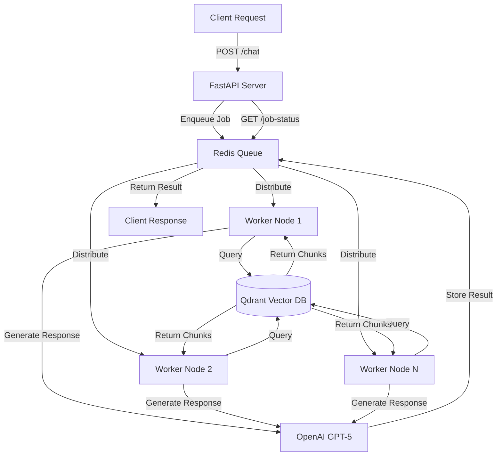

# 🚀 Asynchronous RAG PDF Q&A System

<div align="center">


**A production-grade asynchronous RAG (Retrieval Augmented Generation) system with distributed task processing, enabling scalable PDF querying through REST APIs with Redis Queue and FastAPI.**

[Features](#-features) • [Tech Stack](#-tech-stack) • [Installation](#-installation) • [API Usage](#-api-usage) • [Architecture](#-architecture)

</div>

---

## 📋 Overview

This project implements a **production-ready asynchronous RAG pipeline** with distributed task processing. Built with FastAPI and Redis Queue (RQ), it enables scalable, non-blocking PDF document querying with intelligent context retrieval and AI-powered responses.

### 🎯 Key Highlights

- **Asynchronous Processing**: Non-blocking API with Redis Queue for background task handling
- **RESTful API**: FastAPI endpoints for easy integration
- **Distributed Workers**: Scalable worker nodes for concurrent query processing
- **Vector Search**: Qdrant for high-performance semantic search
- **Source Attribution**: Page-level citations in every response
- **Production Ready**: Docker orchestration with Redis, Qdrant, and worker nodes

---

## ✨ Features

- 🔄 **Async Task Queue**: Redis Queue (RQ) for distributed background processing
- 🌐 **REST API**: FastAPI endpoints for chat and job status tracking
- 📄 **PDF Processing**: Automated document indexing with chunk optimization
- 🔍 **Semantic Search**: Vector similarity search with OpenAI embeddings
- 💬 **AI-Powered Q&A**: GPT-5 integration for intelligent responses
- 📍 **Source Tracking**: Precise page references in answers
- ⚡ **High Performance**: Non-blocking async operations
- 🐳 **Containerized**: Full Docker setup with orchestration
- 🔒 **Secure**: Environment-based configuration
- 📊 **Job Monitoring**: Track query processing status in real-time

---

## 🛠 Tech Stack

<table>
<tr>
<td align="center" width="20%">

<br><strong>Python 3.8+</strong>
<br><sub>Core Language</sub>
</td>
<td align="center" width="20%">

<br><strong>FastAPI</strong>
<br><sub>REST API Framework</sub>
</td>
<td align="center" width="20%">

<br><strong>Redis + RQ</strong>
<br><sub>Task Queue</sub>
</td>
<td align="center" width="20%">

<br><strong>OpenAI</strong>
<br><sub>GPT-5 & Embeddings</sub>
</td>
<td align="center" width="20%">

<br><strong>Qdrant</strong>
<br><sub>Vector Database</sub>
</td>
</tr>
</table>

### Core Dependencies

```python
fastapi               # Modern REST API framework
uvicorn              # ASGI server
redis                # Redis client for Python
rq                   # Redis Queue for async tasks
langchain-openai     # OpenAI integrations
langchain-qdrant     # Qdrant vector store
langchain-community  # Document loaders
python-dotenv        # Environment management
openai               # OpenAI API client
pypdf                # PDF processing
```

---

## 🏗 Architecture



### System Components

#### 1. **FastAPI Server** (`server.py`)
- Exposes REST endpoints
- Enqueues chat queries to Redis
- Provides job status tracking
- Handles request validation

#### 2. **Redis Queue** (`rq_client.py`)
- Manages distributed task queue
- Load balances across workers
- Stores job results
- Enables horizontal scaling

#### 3. **Worker Nodes** (`worker.py`)
- Process queries asynchronously
- Perform vector similarity search
- Generate AI responses with GPT-5
- Return results to Redis

#### 4. **Document Indexing** (`index.py`)
- Loads and chunks PDF documents
- Generates vector embeddings
- Stores in Qdrant with metadata

---

## 🚀 Installation

### Prerequisites

- Python 3.8+
- Docker & Docker Compose
- OpenAI API Key

### 1. Clone Repository

```bash
git clone https://github.com/yourusername/async-rag-system.git
cd async-rag-system
```

### 2. Set Up Environment

```bash
# Create virtual environment
python -m venv venv
source venv/bin/activate  # Windows: venv\Scripts\activate

# Install dependencies
pip install -r requirements.txt
```

### 3. Configure Environment

Create `.env` file:

```env
OPENAI_API_KEY=your_openai_api_key_here
REDIS_HOST=localhost
REDIS_PORT=6379
QDRANT_URL=http://localhost:6333
```

### 4. Start Services

```bash
# Start Redis and Qdrant
docker-compose up -d

# Index your PDF documents
python Doc_Rag_Pipeline/index.py

# Start worker nodes (in separate terminals)
rq worker --with-scheduler

# Start FastAPI server
uvicorn Doc_Rag_Pipeline.server:app --reload
```

---

## 📖 API Usage

### Base URL
```
http://localhost:8000
```

### 1. Health Check

```bash
GET /
```

**Response:**
```json
{
  "status": "Server is up and running"
}
```

### 2. Submit Chat Query

```bash
POST /chat?query=What are the key findings in chapter 3?
```

**Response:**
```json
{
  "status": "queued",
  "job_id": "d4c2a7e8-5f3b-4e1a-9c6d-2b8f7a1e4d3c"
}
```

### 3. Check Job Status & Get Result

```bash
GET /job-status?job_id=d4c2a7e8-5f3b-4e1a-9c6d-2b8f7a1e4d3c
```

**Response:**
```json
{
  "result": "Based on the document, Chapter 3 discusses three key findings: [detailed answer with page references]"
}
```

### Python Client Example

```python
import requests
import time

# Submit query
response = requests.post(
    "http://localhost:8000/chat",
    params={"query": "Explain the methodology"}
)
job_id = response.json()["job_id"]

# Poll for result
while True:
    status = requests.get(
        "http://localhost:8000/job-status",
        params={"job_id": job_id}
    )
    result = status.json()["result"]
    
    if result:
        print(f"🤖: {result}")
        break
    
    time.sleep(2)  # Wait 2 seconds before checking again
```

### cURL Examples

```bash
# Submit query
curl -X POST "http://localhost:8000/chat?query=What%20is%20the%20main%20topic?"

# Get result
curl -X GET "http://localhost:8000/job-status?job_id=YOUR_JOB_ID"
```

---

## 📁 Project Structure

```
async-rag-system/
│
├── Doc_Rag_Pipeline/
│   ├── client/
│   │   ├── __init__.py
│   │   └── rq_client.py          # Redis Queue client setup
│   │
│   ├── queues/
│   │   ├── __init__.py
│   │   └── worker.py             # Worker logic for query processing
│   │
│   ├── __init__.py
│   ├── index.py                  # PDF indexing script
│   └── server.py                 # FastAPI application
│
├── docker-compose.yml            # Redis + Qdrant orchestration
├── .env                          # Environment variables
├── .gitignore                   
├── LICENSE
├── requirements.txt              # Python dependencies
└── README.md
```

---

## ⚙️ Configuration

### Worker Scaling

Run multiple workers for better performance:

```bash
# Terminal 1
rq worker --with-scheduler

# Terminal 2
rq worker --with-scheduler

# Terminal 3
rq worker --with-scheduler
```

### Chunking Parameters

Adjust in `index.py`:

```python
text_splitter = RecursiveCharacterTextSplitter(
    chunk_size=1000,
    chunk_overlap=400
)
```

### Redis Configuration

Update in `rq_client.py`:

```python
queue = Queue(connection=Redis(
    host="localhost",
    port=6379,
    db=0,
    decode_responses=True
))
```

### API Server Settings

```bash
# Development
uvicorn Doc_Rag_Pipeline.server:app --reload --host 0.0.0.0 --port 8000

# Production
uvicorn Doc_Rag_Pipeline.server:app --workers 4 --host 0.0.0.0 --port 8000
```

---

## 🔍 How It Works

### Query Flow

1. **Client** sends chat query to FastAPI endpoint
2. **Server** enqueues job in Redis Queue with unique ID
3. **Worker** picks up job from queue
4. **Worker** performs vector search in Qdrant
5. **Worker** sends context + query to GPT-5
6. **Worker** stores result back in Redis
7. **Client** polls `/job-status` to retrieve answer

### Benefits of Async Architecture

- ✅ **Non-blocking**: Server responds immediately
- ✅ **Scalable**: Add workers to handle more load
- ✅ **Reliable**: Redis persists jobs
- ✅ **Efficient**: Workers process queries in parallel
- ✅ **Resilient**: Failed jobs can be retried

---

## 🐳 Docker Deployment

### docker-compose.yml

```yaml
version: '3.8'

services:
  redis:
    image: redis:7-alpine
    ports:
      - "6379:6379"
    volumes:
      - redis_data:/data

  qdrant:
    image: qdrant/qdrant:latest
    ports:
      - "6333:6333"
    volumes:
      - qdrant_data:/qdrant/storage

volumes:
  redis_data:
  qdrant_data:
```

### Start All Services

```bash
docker-compose up -d
```

---

## 🧪 Testing

### API Testing with HTTPie

```bash
# Install httpie
pip install httpie

# Test endpoints
http GET http://localhost:8000/
http POST http://localhost:8000/chat query=="What is RAG?"
http GET http://localhost:8000/job-status job_id==YOUR_JOB_ID
```

### Monitor Redis Queue

```bash
# Install RQ Dashboard
pip install rq-dashboard

# Start dashboard
rq-dashboard

# Open browser: http://localhost:9181
```

---

## 🤝 Contributing

Contributions welcome! Please follow these steps:

1. Fork the repository
2. Create feature branch (`git checkout -b feature/NewFeature`)
3. Commit changes (`git commit -m 'feat: add new feature'`)
4. Push to branch (`git push origin feature/NewFeature`)
5. Open Pull Request

---

## 📝 License

This project is licensed under the MIT License - see [LICENSE](LICENSE) file.

---

## 🙏 Acknowledgments

- [FastAPI](https://fastapi.tiangolo.com/) for the amazing web framework
- [Redis Queue](https://python-rq.org/) for simple async task processing
- [LangChain](https://langchain.com/) for RAG orchestration
- [Qdrant](https://qdrant.tech/) for vector database
- [OpenAI](https://openai.com/) for GPT and embeddings

---


<div align="center">

**⭐ Star this repo if you found it helpful!**


</div>